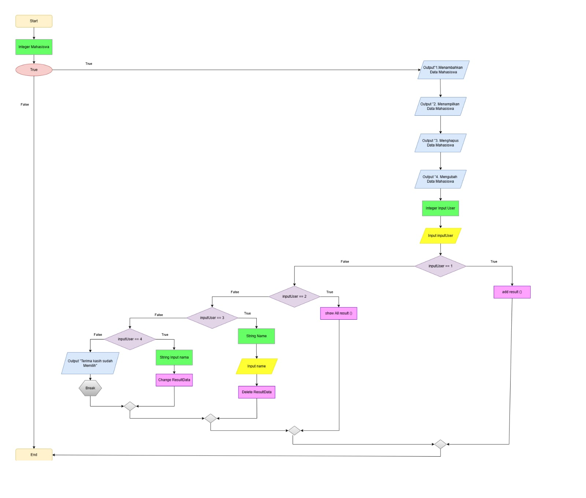
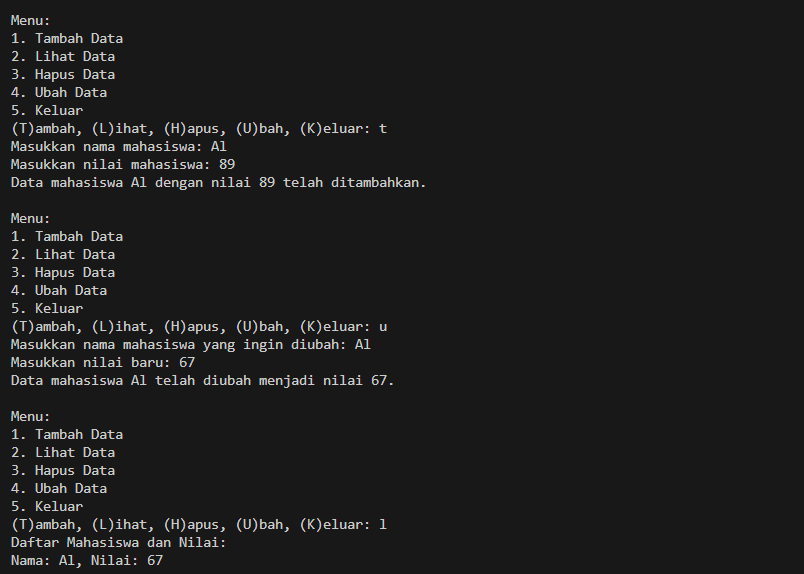
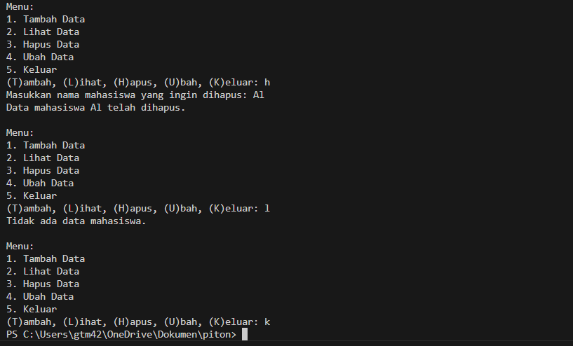

# "Program Menampilkan Daftar Nilai Mahasiswa"
# Deskripsi Program
Program sederhana ini dibuat menggunakan bahasa python Dictionary dengan fitur:

Pengguna untuk mengelola data mahasiswa, termasuk menambah, mengubah, menghapus, dan menampilkan nilai mahasiswa
## Flowchart Program

# Kode Program
```python
MH = {}

# Fungsi untuk menambah data
def tambah(nama, nilai):
    MH[nama] = nilai
    print(f"Data mahasiswa {nama} dengan nilai {nilai} telah ditambahkan.")

# Fungsi untuk menampilkan data
def lihat():
    if MH:
        print("Daftar Mahasiswa dan Nilai:")
        for nama, nilai in MH.items():
            print(f"Nama: {nama}, Nilai: {nilai}")
    else:
        print("Tidak ada data mahasiswa.")

# Fungsi untuk menghapus data berdasarkan nama
def hapus(nama):
    if nama in MH:
        del MH[nama]
        print(f"Data mahasiswa {nama} telah dihapus.")
    else:
        print(f"Mahasiswa dengan nama {nama} tidak ditemukan.")

# Fungsi untuk mengubah data berdasarkan nama
def ubah(nama, nilai_baru):
    if nama in MH:
        MH[nama] = nilai_baru
        print(f"Data mahasiswa {nama} telah diubah menjadi nilai {nilai_baru}.")
    else:
        print(f"Mahasiswa dengan nama {nama} tidak ditemukan.")

# Menu untuk pilihan
def menu():
    while True:
        print("\nMenu:")
        print("1. Tambah Data")
        print("2. Lihat Data")
        print("3. Hapus Data")
        print("4. Ubah Data")
        print("5. Keluar")
        pilihan = input("(T)ambah, (L)ihat, (H)apus, (U)bah, (K)eluar: ")

        if pilihan == 't':
            nama = input("Masukkan nama mahasiswa: ")
            nilai = input("Masukkan nilai mahasiswa: ")
            tambah(nama, nilai)
        elif pilihan == 'l':
            lihat()
        elif pilihan == 'h':
            nama = input("Masukkan nama mahasiswa yang ingin dihapus: ")
            hapus(nama)
        elif pilihan == 'u':
            nama = input("Masukkan nama mahasiswa yang ingin diubah: ")
            nilai_baru = input("Masukkan nilai baru: ")
            ubah(nama, nilai_baru)
        elif pilihan == 'k':
            break
        else:
            print("coba lagi.")

menu()
```
# Output Program



# Cara Kerja Program
1. *Inisialisasi*:
   - Program dimulai dengan mendeklarasikan dictionary kosong mahasiswa untuk menyimpan data mahasiswa.

2. *Menu Utama*:
   - Program menampilkan menu interaktif yang memungkinkan pengguna untuk memilih salah satu dari lima opsi:
     - *Tambah Data*: Menambah data mahasiswa baru ke dalam dictionary.
     - *Tampilkan Data*: Menampilkan seluruh daftar mahasiswa beserta nilai mereka.
     - *Hapus Data*: Menghapus data mahasiswa berdasarkan nama.
     - *Ubah Data*: Mengubah nilai mahasiswa berdasarkan nama.
     - *Keluar*: Keluar dari program.

3. *Fungsi-fungsi Utama*:
   - *tambah(nama, nilai)*: Fungsi ini digunakan untuk menambah data mahasiswa ke dalam dictionary. Nama mahasiswa menjadi key, dan nilai mahasiswa menjadi value.
   - *tampilkan()*: Fungsi ini menampilkan seluruh data mahasiswa dalam dictionary. Jika dictionary kosong, program akan memberi pesan bahwa tidak ada data mahasiswa.
   - *hapus(nama)*: Fungsi ini menghapus data mahasiswa berdasarkan nama yang diberikan. Jika nama ditemukan, data akan dihapus; jika tidak, program memberi pesan bahwa nama tersebut tidak ditemukan.
   - *ubah(nama, nilai_baru)*: Fungsi ini mengubah nilai mahasiswa berdasarkan nama. Jika nama ditemukan, nilai mahasiswa akan diperbarui dengan nilai baru yang diberikan.

4. *Proses Pengguna*:
   - Pengguna akan dipandu melalui menu untuk memilih tindakan yang ingin dilakukan.
   - Setelah memilih tindakan, pengguna akan diminta untuk memasukkan data yang diperlukan (nama mahasiswa dan nilai).
   - Setelah selesai dengan tindakan yang dipilih, program akan kembali menampilkan menu utama.
   - Program akan terus berjalan hingga pengguna memilih opsi "Keluar" untuk keluar dari aplikasi.